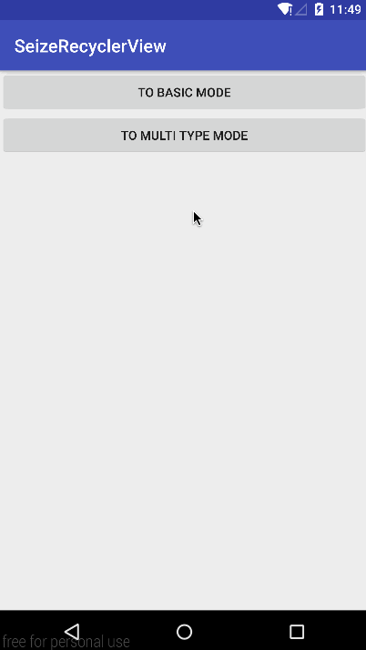
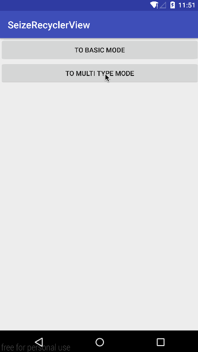

# SeizeRecyclerView

### Use multiple adapters for a single RecyclerView.

 

## How to use

```java
feedRv = (RecyclerView) findViewById(R.id.activity_main_rv);

// The whole origin adapter of RecyclerView
adapter = new FeedAdapter();
// set header and footer for the whole origin adapter of RecyclerView
adapter.setHeader(headerView = inflaterHeaderOrFooterAndBindClick(R.layout.header_film));
adapter.setFooter(footerView = inflaterHeaderOrFooterAndBindClick(R.layout.footer_film));

// attach seize adapters to origin adapter of RecyclerView
adapter.setSeizeAdapters(
        filmActorSeizeAdapter = new FilmActorSeizeAdapter(),
        filmCommentSeizeAdapter = new FilmCommentSeizeAdapter()
);

// set header and footer for the film actor seize adapter
filmActorSeizeAdapter.setOnFilmActorSeizeAdapterListener(this);
filmActorSeizeAdapter.setHeader(actorHeaderView = inflaterHeaderOrFooterAndBindClick(R.layout.header_film_actor));
filmActorSeizeAdapter.setFooter(actorFooterView = inflaterHeaderOrFooterAndBindClick(R.layout.footer_film_actor));

// set header and footer for the film comment seize adapter
filmCommentSeizeAdapter.setOnFilmCommentSeizeAdapterListener(this);
filmCommentSeizeAdapter.setHeader(commentHeaderView = inflaterHeaderOrFooterAndBindClick(R.layout.header_film_comment));
filmCommentSeizeAdapter.setFooter(commentFooterView = inflaterHeaderOrFooterAndBindClick(R.layout.footer_film_comment));

LinearLayoutManager layoutManager = new LinearLayoutManager(this);
layoutManager.setOrientation(LinearLayoutManager.VERTICAL);
feedRv.setLayoutManager(layoutManager);

// set origin adapter to RecyclerView
feedRv.setAdapter(adapter);
```

```java
public void onRequestActors(List<ActorVM> list) {
    filmActorSeizeAdapter.addList(list);
    filmActorSeizeAdapter.notifyDataSetChanged();
}

public void onRequestComment(List<CommentVM> list) {
    filmCommentSeizeAdapter.addList(list);
    filmCommentSeizeAdapter.notifyDataSetChanged();
}
```

License
=======

    Copyright 2017 Wang Jie

    Licensed under the Apache License, Version 2.0 (the "License");
    you may not use this file except in compliance with the License.
    You may obtain a copy of the License at

       http://www.apache.org/licenses/LICENSE-2.0

    Unless required by applicable law or agreed to in writing, software
    distributed under the License is distributed on an "AS IS" BASIS,
    WITHOUT WARRANTIES OR CONDITIONS OF ANY KIND, either express or implied.
    See the License for the specific language governing blacklist and
    limitations under the License.

